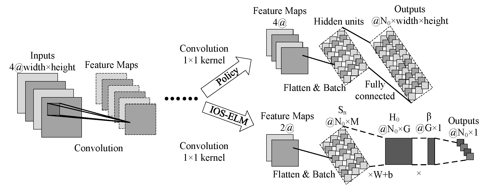

# IOS-ELM
<p align="center">
  
</p>
A Python implementation AZ-style-Gomoku with OS-ELM.
I will not recommend using this code if you don't have GPUs > 10 or more. I use this code just to prove that I have no problem with my ideas, not to get the strong strength of Gomoku. Although I have ever imagined it, due to the serious lack of equipment, I gave up its landing value and turned to explore its scientific value.

## Requirements

keras==2.0.5
tensorflow-gpu==1.1.0
cudnn==6.0
cudatoolkit==8.0

Note that cuda and cudnn can be installed in Anaconda.

## Usage

**Train model** 
```
python train.py
```

**Play with model** 
```
python human_play.py
```

## Citation
If you use any part of this code in your research, please cite our [paper](10.1109/ACCESS.2019.2938568):
```
@article{article,
author = {XiaLi, Li and He, Shuai and Wei, Zhi and Wu, Licheng},
title = {Improved Online Sequential Extreme Learning Machine: A New Intelligent Evaluation Method for AZ-style Algorithms},
journal = {IEEE Access},
}
```

Some of the code comes from this [link](https://zhuanlan.zhihu.com/p/32089487)